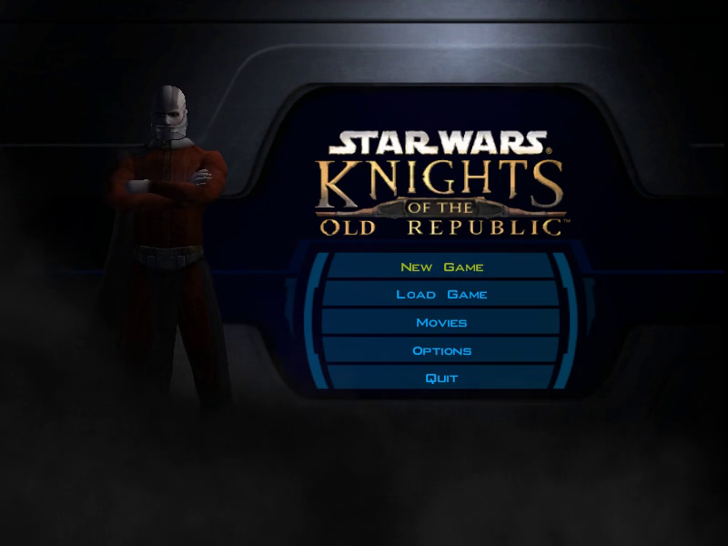
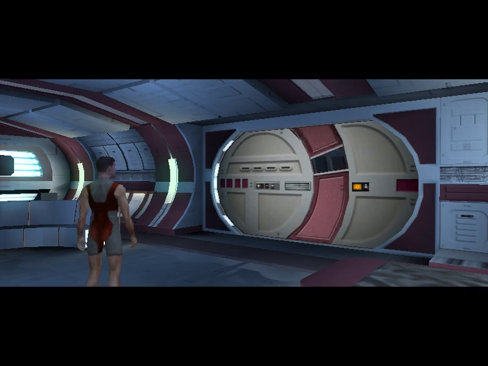
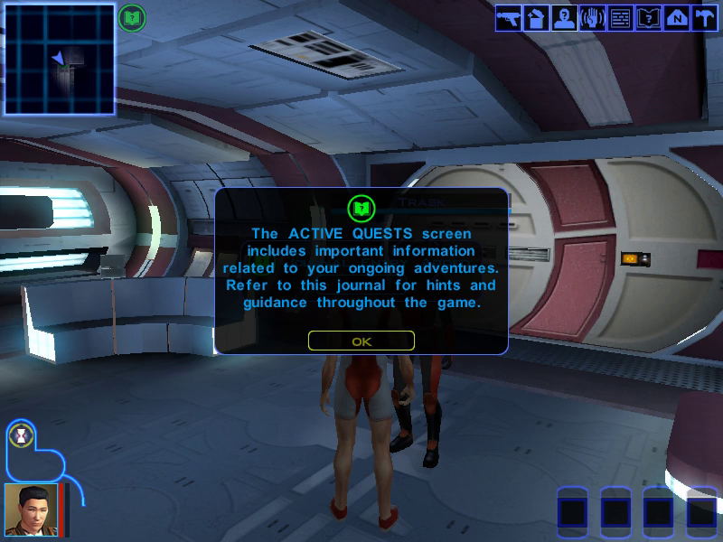

# Star Wars: Knights of the Old Republic — Static Recompilation

Static recompilation of **Star Wars: Knights of the Old Republic** (BioWare, 2003) from its
shipping Win32 binary, `swkotor.exe` 1.03 (Steam), to native C. The point past running it
is to fix the engine's long-standing problems on modern PCs in the game's own code: the
uncapped frame rate, the grass, the lost lighting and shader effects, widescreen, and the
movies (see [ROADMAP.md](ROADMAP.md)).

Built on the [pcrecomp](https://github.com/sp00nznet/pcrecomp) toolchain and following its
shared house style (layout, CLI, harness, headless mode). This is not a reimplementation
like reone or xoreos: it runs BioWare's own code, recompiled.

**Generated source is not distributed.** You supply your own copy of the game; the
pipeline unwraps, lifts and builds it locally, and everything it generates stays in
gitignored folders (`work/`, `src/recomp/gen/`). Nothing from the game is in this repo.

## Status: **v0.1.0-dev, alpha — a new game plays into the Endar Spire, in the recompiled code.**

| Stage | State |
|---|---|
| P0: pick the build | Steam `swkotor.exe` 1.03 (2004-02-12), SteamStub 2.x wrapped ([RECON.md](docs/RECON.md)) |
| Reference run | `--original` runs the unwrapped exe's own machine code under the same host and shims, for comparison |
| Headless mode | `--headless --record out.mp4`: hidden window, frames read back from GL and piped to ffmpeg; `--click x,y@s` and `--key NAME@s` drive it (the keyboard through a DirectInput hook) |
| Gamepad | XInput controllers, which the original never supported: sticks, triggers and buttons sent as the game's own keys, cursor and clicks ([gamepad.md](docs/gamepad.md)); untested on a real pad yet |
| Steam wrapper | removed statically by pcrecomp `drm/steamstub.py` (#46): no Steam, under a second |
| RTTI | none (built without it); `vtable_scan` finds 233 vtables, 1,852 methods |
| Function catalog (`disasm32`) | 29,548 functions, 96.6% of `.text`, no IDA (needs pcrecomp #50: the script-command table setup is 7 KB of straight-line code) |
| Lift (`run_lift.py --all`) | 29,617 functions, 4.2M lines of C, **0 lift errors** |
| Host (`build/kotor.exe`, 32-bit, pcrecomp `native32`) | builds with MSVC or clang-cl; self-contained (static CRT). Boots through the intro to the main menu, then a scripted new game: character generation, the Endar Spire load, Trask's conversation answered by keys, and play with the HUD, all in lifted code |
| Conformance harness | `tools/conformance.py`: **11/11** milestones, from boot to the opening conversation on the Endar Spire, lift 0 errors, against `conformance.json`; fails on regression ([testing.md](docs/testing.md)) |

Runs are **muted by default** until sound has been tested (`--sound` unmutes).

## Screenshots

Frames drawn by the recompiled code (`--headless --record`, muted). The main menu:



The Endar Spire after a scripted new game, the opening cutscene:



And in play after Trask's conversation, answered by scripted keys, with the HUD and the first tutorial popup:



## Getting Started

You need the Steam copy of KotOR, Windows 10/11 x64, and about 2 GB free. The game folder
is read in place; it is not copied.

### Quick start

1. Download this repository (Code → Download ZIP) and unzip it anywhere.
2. Double-click **`Setup.cmd`**. It checks for Python, the Python packages, pcrecomp, Visual
   Studio, CMake and Ninja, and asks before installing anything that is missing. It finds
   KotOR in your Steam library (or asks for the folder), then unwraps, catalogs, lifts and
   builds. 30 to 60 minutes the first time; a rerun skips finished steps. If it stops, it
   says why in one sentence and keeps the details in `setup.log`.
3. Double-click **`KotOR (recomp).cmd`**.

### Step by step

Prerequisites: Python 3.10+ (`py -3` — the Microsoft Store's `python` alias is a
placeholder that opens the Store; turn it off in *App execution aliases* if `python` does
nothing), Visual Studio 2022 or Build Tools with *Desktop development with C++*, CMake 3.20+,
Ninja, Git.

```
git clone https://github.com/sp00nznet/pcrecomp ..\pcrecomp
py -3 -m pip install --user pefile capstone cryptography
mklink /J game "C:\Program Files (x86)\Steam\steamapps\common\swkotor"
mkdir work
py -3 ..\pcrecomp\tools\drm\steamstub.py game\swkotor.exe work\swkotor.exe
py -3 ..\pcrecomp\tools\cpp\vtable_scan.py work\swkotor.exe --seeds work\vtable_seeds.json
py -3 ..\pcrecomp\tools\disasm\disasm32.py work\swkotor.exe -o work\functions.json --seed-functions work\vtable_seeds.json
py -3 run_lift.py --all
build.cmd
```

Expected output, in order:

```
SteamStub 2.x: app 32370, header 0x0086F204, steamdrm.dll 0x0086F568 (0x51C00 bytes)
  .text 0x00401000+0x33BFF0 decrypted (AES-256-CBC); OEP 0x006FB38D
[*] wrote work\vtable_seeds.json (1,852 seeds)
[*] Functions: 29418  (thunks=38, leaves=12988)
  lifted 29488   not-lifted stubs 0   errors 0   no terminator 162
```

`mklink /J` needs no admin rights; use the folder your Steam library actually has. A new
terminal is needed after installing Python or CMake, before they are on `PATH`.

## Usage

```
build\kotor.exe                       # dry run: map the image and bind the imports
build\kotor.exe --run                 # run (muted)
build\kotor.exe --run --headless --watchdog 60   # hidden window, stop after 60 s
build\kotor.exe --run --sound         # with sound
build\kotor.exe --run --headless --record out.mp4 --watchdog 60   # no window: record what it draws
build\kotor.exe --run --original      # the shipping machine code under the same host, for comparison
build\kotor.exe --run --headless --click 488,293@3   # click New Game 3 s after the main menu appears
build\kotor.exe --run --headless --key W@a30:3000     # hold W for 3 s, 30 s after an area loads
build\kotor.exe --run --no-gamepad   # ignore the controller (it is on by default when the window is shown)
py -3 tools\conformance.py            # boot milestones + lift health vs. conformance.json
py -3 tools\conformance.py --host D:\kotor.exe   # a host built elsewhere
```

`--modeswitch` and `--gamma` let the game change the display mode and gamma ramp. Both are
off by default, because the game changes the primary display's mode, not the one its
window is on.

## Building from source

`run_lift.py --all` then `build.cmd` (MSVC x86 via `vcvarsall amd64_x86`, CMake, Ninja).
The host also builds with clang-cl (`-DXWIN_ARCH=x86 -DGEN_OPT=/O1`; `/O1` because clang's
`/O2` loop unswitching is quadratic on the lift's largest functions).
`PCRECOMP` (environment for `run_lift.py`, CMake cache variable for the build) points at
another toolkit checkout; the default is `..\pcrecomp`.

## Documentation

- [docs/RECON.md](docs/RECON.md): the binary, the Steam wrapper layer by layer, the game
  data, community material and its licences, the engine fix list.
- [docs/architecture.md](docs/architecture.md): the pipeline and the host.
- [docs/testing.md](docs/testing.md): the conformance harness, its milestones and the new-game click script.
- [docs/gamepad.md](docs/gamepad.md): controller support, the button mapping and its tuning knobs.

## License

MIT for the code in this repository ([LICENSE](LICENSE)). Star Wars: Knights of the Old
Republic is © BioWare / Lucasfilm; none of its files are included.
